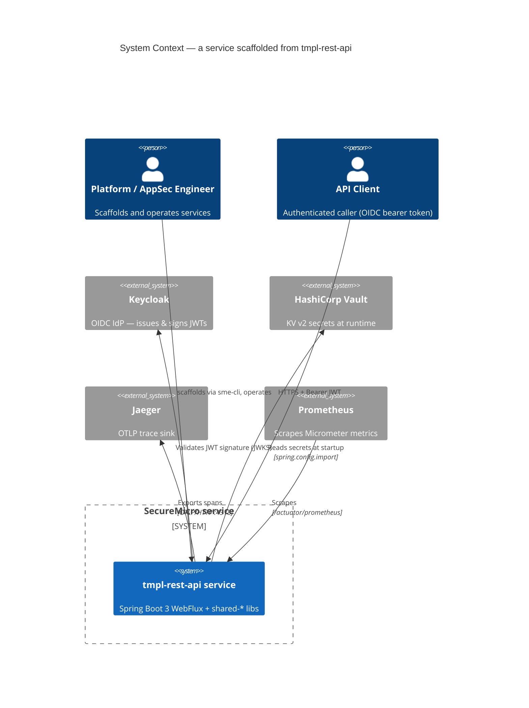
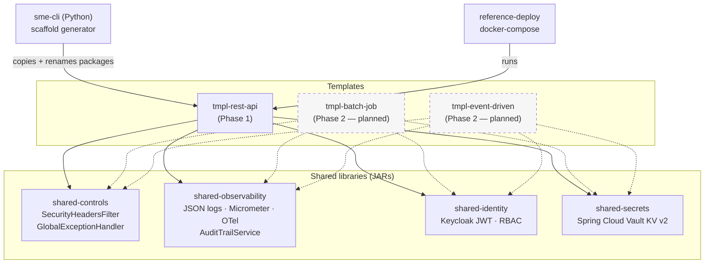
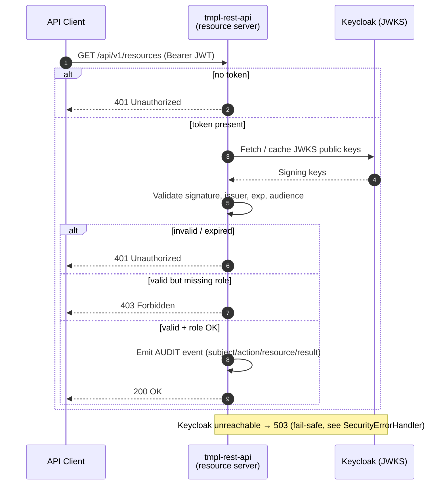
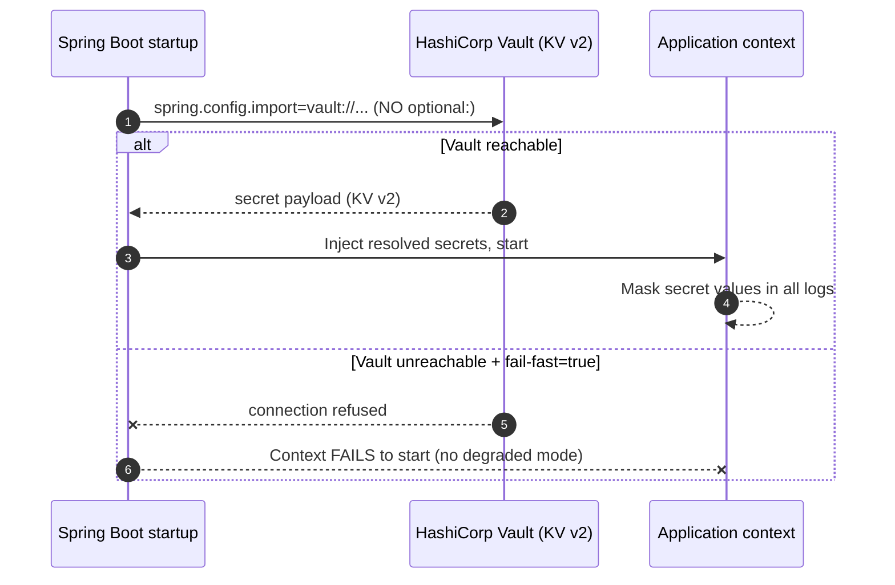
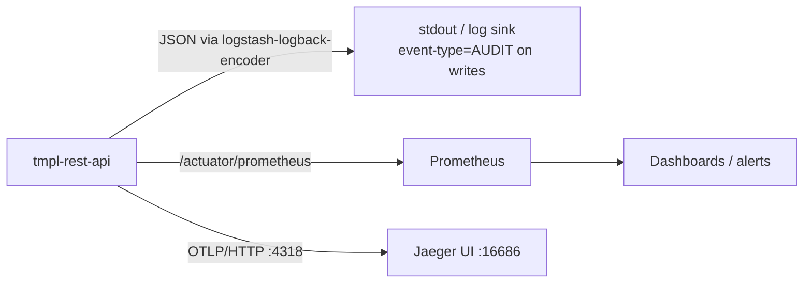

# Architecture — SecureMicro-Energy-Templates

Visual reference for how the templates, shared libraries, and runtime
dependencies fit together. Diagrams use [Mermaid](https://mermaid.js.org/) and
render natively on GitHub.

---

## 1. System context (C4 — Level 1)

How a scaffolded service sits between the operator, the federal-aligned control
plane, and the observability backends.

---

## 2. Module / dependency graph (C4 — Level 2)

Maven reactor. Every Phase 1 template depends on the four `shared-*` libraries;
`sme-cli` consumes the templates as scaffold sources.

---

## 3. Authentication & authorization flow

OIDC bearer token validation on the WebFlux resource server. Maps to NIST
**IA-2 / IA-5** and demonstrates the 401 / 403 / 200 decision tree validated in
TASK-029 (AC-3).

---

## 4. Secrets-at-runtime flow (zero secrets in config)

Maps to EO 14028 §4(e) and NIST **SC-12**. `fail-fast: true` means the context
refuses to start if Vault is unreachable — validated by `VaultFailFastTest`
(AC-12).

---

## 5. Observability pipeline

Three signals from one service: structured JSON logs, Micrometer/Prometheus
metrics, OpenTelemetry traces. Maps to NIST **AU-2 / AU-3** and INI-18/19/21.

---

## Federal control alignment

Each architectural element traces to a federal clause. Full bidirectional
mapping (control ↔ code) lives in
[`docs/control-mappings/tmpl-rest-api-controls.md`](../control-mappings/tmpl-rest-api-controls.md)
and the per-template [`threat-model.md`](../threat-models/tmpl-rest-api-threat-model.md).

| Element | Control | Federal reference |
|---|---|---|
| OIDC auth flow (§3) | IA-2, IA-5 | NIST SP 800-53 Rev 5 |
| Vault secrets (§4) | SC-12 | EO 14028 §4(e) |
| Audit / metrics / traces (§5) | AU-2, AU-3 | NIST SP 800-53 Rev 5 |
| Security headers (shared-controls) | SC-8 | NIST, CISA Secure by Design |
| SBOM per build | — | EO 14028 §4(e) |
